<!-- Replace every YOUR_USERNAME with your GitHub username -->


<p align="center">
  <a href="https://github.com/SUGAM2001">
    
  </a>
</p>

<br>

<p align="center">
  
</p>

### `$ cat about.txt`

```bash
> role        : Bioinformatics Student
> passion     : Machine Learning + Genomics Data Analysis
> mission     : Exploring the intersection of biology, data & computational science
> status      : Constantly learning, always growing
```

### `$ cat skills.txt`
<p>
  
  
  
  
  
  
  
  
</p>


### `$ git stats`

<p align="center">
  
  
</p>

<p align="center">
  
</p>

### `$ ./connect.sh`

<p>
  <a href="mailto:your.email@example.com"></a>
  <a href="https://www.linkedin.com/in/YOUR_LINKEDIN"></a>
  <a href="https://www.kaggle.com/YOUR_KAGGLE"></a>
</p>

<p align="center">
  
</p>

<p align="center"><i>🌻 Like a sunflower, always turning toward new knowledge 🌻</i></p>


